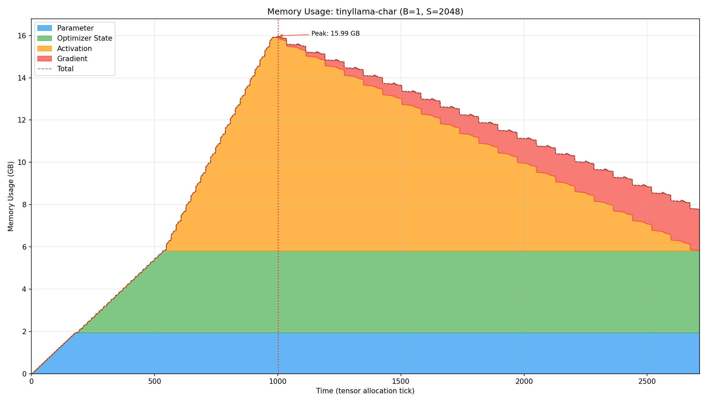

# tt-train-roofline

Roofline performance analysis tool for training transformer models on Tenstorrent hardware. It simulates a full training loop — forward pass, backward pass, optimizer step — using metadata-only mock tensors, estimating ideal execution time, memory usage, and compute/memory bottlenecks without requiring actual hardware.

The module interface mirrors [ttml](https://github.com/tenstorrent/tt-metal/tree/main/tt-train) (Tenstorrent's training framework), which itself is similar to PyTorch: models are built from composable modules, operations produce and consume tensors, and gradients flow through an autograd-style backward graph.

## How It Works

Each operation (matmul, layernorm, softmax, etc.) is implemented as a `RooflineFunction` that:

1. Computes output tensor **shapes** (no actual data).
2. Calculates the **FLOPs** and **bytes transferred** for both forward and backward passes.
3. Creates a `RooflineEstimate` and registers it with the `RooflineContext`.

The `RooflineContext` accumulates all estimates across the training iteration and classifies each operation as **compute-bound** or **DRAM-bound** based on the hardware's peak TFLOPS and memory bandwidth.

A `MemoryTracker` runs alongside, logging every allocation and deallocation by category (parameters, activations, gradients, optimizer state), enabling peak memory analysis and memory usage plots.

## Architecture

```
roofline/
├── roofline/        # Core roofline math per op (FLOPs, bytes, ideal time)
├── operations/      # RooflineFunction wrappers that build the backward graph
├── modules/         # High-level modules (Linear, Attention, GPTBlock, Llama, ...)
├── training/        # AdamW optimizer, gradient clipping
├── examples/        # Ready-to-run analysis scripts
├── hardware.py      # Hardware specs (Wormhole N150/N300, Blackhole P100/P150)
├── mock_tensor.py   # Metadata-only tensor with autograd graph
└── memory_tracker.py# Allocation tracking and plotting
```

**Supported hardware:** Wormhole N150, Wormhole N300, Blackhole P100, Blackhole P150

**Supported models:** NanoGPT (char/BPE), GPT-2 (Small/Medium/Large), NanoLlama, TinyLlama 1.1B, Llama 3.x (1B, 8B, 70B, 405B)

**Supported operations:** MatMul, Linear, Embedding, LayerNorm, RMSNorm, Softmax, Scaled Dot-Product Attention (unfused & fused), RoPE, Dropout, SiLU, GELU, SwiGLU (fused), Cross-Entropy Loss

## Examples

All examples are run from the repository root.

### Full training analysis

Analyze a complete training iteration (forward + backward + optimizer) for any supported model:

```bash
# NanoGPT on Shakespeare (default)
python3 -m roofline.examples.training

# TinyLlama 1.1B, batch=1, seq=2048
python3 -m roofline.examples.training --model tinyllama -b 1 -s 2048

# Llama 8B on Blackhole P150
python3 -m roofline.examples.training --model llama-8b -b 1 -s 8192 --hardware p150

# List all available model presets
python3 -m roofline.examples.training --list
```

Outputs timing breakdown (forward/backward/optimizer), throughput (tokens/sec), bottleneck classification per op, peak memory, and memory usage plots.

Example of output:
```
======================================================================
TRANSFORMER MODEL ROOFLINE ANALYSIS
======================================================================

Hardware: Blackhole
  Cores:      120
  Clock:      1.35 GHz
  DRAM BW:    480 GB/s
  Peak (HiFi4): 165.9 TFLOPs

Model: tinyllama-char (Llama)
Description: TinyLlama 1.1B (char tokenizer, 0.96B params)

Model Configuration:
  vocab_size:         96
  max_sequence_length: 2048
  embedding_dim:      2048
  num_blocks:         22
  num_heads:          32
  num_groups:         4
  dropout:            0.0
  theta:              10000.0

Batch Configuration:
  batch_size:  1
  seq_len:     2048

Model Statistics:
  Parameters:  969,369,600 (969.4M)
  Param Memory: 1.939 GB (BF16)

----------------------------------------------------------------------
Running Analysis: B=1, S=2048
----------------------------------------------------------------------
--- AFTER_MODEL_CREATION ---
  Current Memory: 1938.74 MB
--- AFTER_OPTIMIZER_CREATION ---
  Current Memory: 5816.22 MB
--- AFTER_FORWARD_PASS ---
  Current Memory: 15914.41 MB
--- AFTER_BACKWARD_PASS ---
  Current Memory: 7754.96 MB
--- AFTER_OPTIMIZER_STEP ---
  Current Memory: 7754.96 MB
--- ITERATION_COMPLETE ---
  Current Memory: 7754.96 MB
Peak Memory Usage: 15.990 GB (15,990,300,674 bytes)
Peak Memory Breakdown by category:
  parameter      : 1.939 GB (12.1%)
  optimizer_state: 3.877 GB (24.2%)
  activation     : 10.073 GB (63.0%)
  gradient       : 0.101 GB (0.6%)

Timing Breakdown:
  Forward:     110.3905 ms (4.7669 TFLOPs)
  Backward:    194.7631 ms (9.4815 TFLOPs)
  Optimizer:   28.2733 ms (0.0010 TFLOPs)
  Grad Clip:   20.1952 ms (0.0029 TFLOPs)
  Total:       353.6221 ms (14.2523 TFLOPs)

Throughput:
  Tokens/iter: 2,048
  Tokens/sec:  5,791
  TFLOPs:      40.30

Bottleneck Analysis:
  DRAM: 961 ops
  COMPUTE: 330 ops
  BOTH: 66 ops

----------------------------------------------------------------------
Memory Tracking Analysis
----------------------------------------------------------------------
Peak Memory Usage: 15.990 GB (15,990,300,674 bytes)
Peak Memory Breakdown by category:
  parameter      : 1.939 GB (12.1%)
  optimizer_state: 3.877 GB (24.2%)
  activation     : 10.073 GB (63.0%)
  gradient       : 0.101 GB (0.6%)
Memory usage plot saved to: memory_usage_tinyllama-char_b1_s2048.png
Memory usage plot saved to: memory_detail_tinyllama-char_b1_s2048.png

======================================================================
ANALYSIS COMPLETE
======================================================================
```

Memory plot example:


### Fused vs unfused attention

Compare standard multi-head attention against fused (Flash Attention-style) SDPA across multiple model sizes:

```bash
python3 -m roofline.examples.attention_comparison
```

### SwiGLU comparison

Compare different SwiGLU MLP implementations:

```bash
python3 -m roofline.examples.swiglu_comparison
```

### Matmul benchmarking

Roofline analysis for matrix multiplications across a range of shapes:

```bash
python3 -m roofline.examples.benchmark_matmuls
```

### Simple matmul pipeline

Minimal example — a 5-layer linear model showing per-layer roofline breakdown:

```bash
python3 -m roofline.examples.matmuls
```

## Dependencies

Python 3.10+ with only standard-library dependencies. `matplotlib` is optional (used for memory usage plots).
